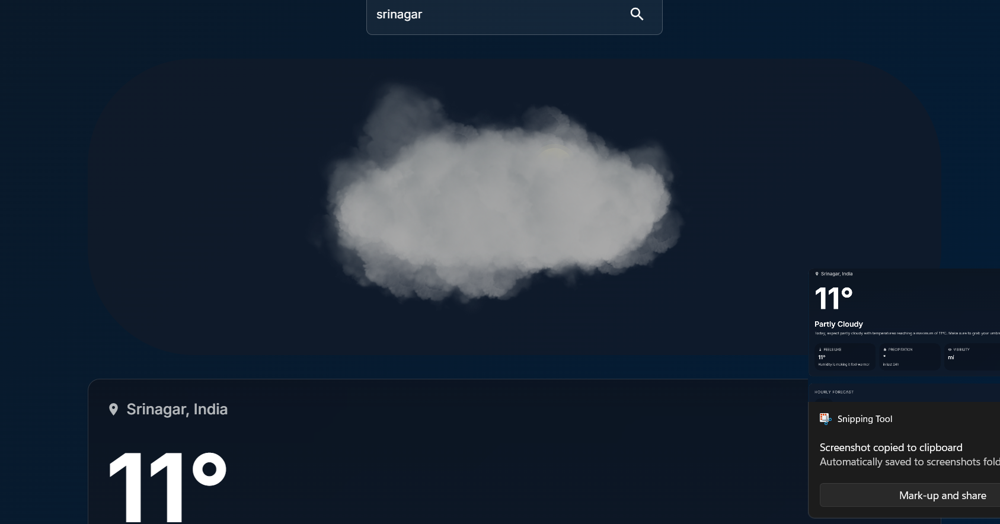

# Weather 3D React App 🌦️

A modern, interactive 3D weather visualization application built with React, TypeScript, and Three.js. Experience weather data like never before with stunning 3D animations and a sleek, professional interface.



## ✨ Features

- 🌍 Real-time weather data visualization
- 🎨 Interactive 3D weather scenes
- 📱 Responsive design for all devices
- 🔍 Location-based weather detection
- 🕒 Hourly weather forecasts
- 🌡️ Detailed weather metrics
- 🎭 Dynamic weather animations

## 🛠️ Technologies

- React 18
- TypeScript
- Three.js / React Three Fiber
- Material-UI
- Framer Motion
- WeatherAPI.com

## 🚀 Getting Started

1. Clone the repository:
```bash
git clone https://github.com/Muhammad-izhaan/weather-react-3d.git
```

2. Install dependencies:
```bash
cd weather-react-3d
npm install
```

3. Create a `.env` file in the root directory and add your WeatherAPI key:
```env
REACT_APP_WEATHER_API_KEY=your_api_key_here
```

4. Start the development server:
```bash
npm start
```

## 📝 Environment Variables

- `REACT_APP_WEATHER_API_KEY`: Your WeatherAPI.com API key

## 🌟 Features in Detail

- **3D Weather Visualization**: Dynamic 3D scenes that change based on current weather conditions
- **Real-time Weather Data**: Accurate weather information from WeatherAPI.com
- **Location Detection**: Automatic location detection with fallback to IP-based location
- **Search Functionality**: Search for weather information by city or location
- **Hourly Forecast**: Detailed hourly weather predictions
- **Responsive Design**: Optimized for both desktop and mobile devices

## 🤝 Contributing

Contributions are welcome! Feel free to submit issues and pull requests.

## 📄 License

This project is licensed under the MIT License - see the LICENSE file for details.

## 👨‍💻 Author

Muhammad Izhan
